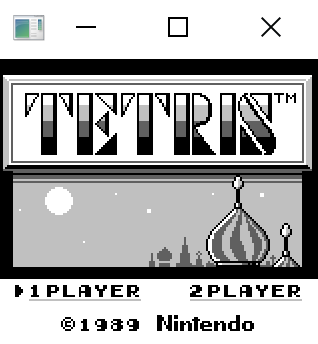
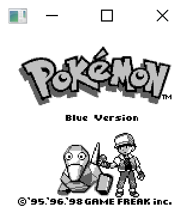
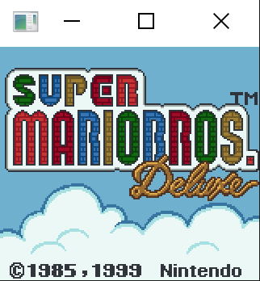
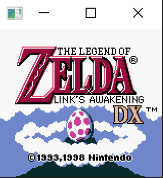

# SrikurGB
Gameboy Emulator in Rust by Srikur Kanuparthy

This is a work in progress. Written in Rust. Requires SDL2.

## TODO
- Fix timing and FPS synchronization
- Add Python + Lua scripting
- Add GUI to select rom
- Add sound
- Add serial support
- Fix GBC graphics issues

## Resources
Would not have even remotely been possible for me to create this without these resources and so many more.
- https://reddit.com/r/emudev/
- https://github.com/gbdev/awesome-gbdev#opcodes
- https://rednex.github.io/rgbds/gbz80.7.html#CALL_n16
- https://gbdev.io/gb-opcodes/optables/
- https://gbdev.io/pandocs/
- http://www.codeslinger.co.uk/pages/projects/gameboy/graphics.html
- https://gbdev.gg8.se/wiki/articles/Video_Display
- https://gbdev.gg8.se/wiki/articles/Gameboy_Bootstrap_ROM#Contents_of_the_ROM
- https://github.com/mohanson/gameboy/blob/master/src/
